# Exploring Linked Data from Tropy in Excel

## Using the Text Import Wizard

Having exported the CSV file from Open Refine, import the same file into Excel. You will need to use the Text Import Wizard to allow Excel to read the data correctly.

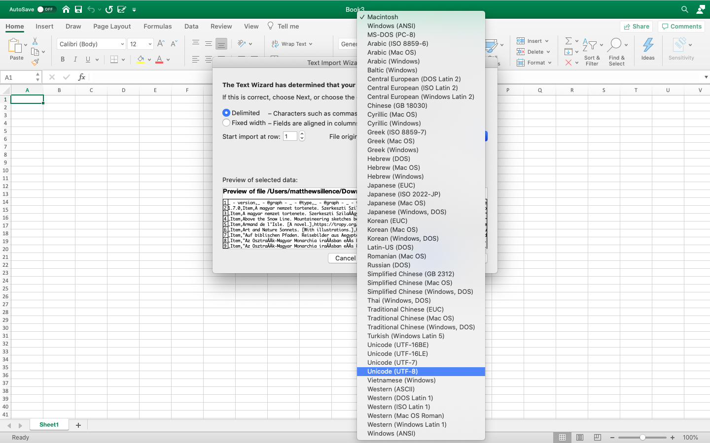

Choose 'Delimited' to allow the commas to indicate where the field separations occur. It is also useful to change the 'File origin' to 'Unicode \(UTF-8\)' to allow the titles of publications to retain the correct [characters for different languages](open-refine.md#3-1-a-note-on-character-encoding). Click 'Next' to save the settings.

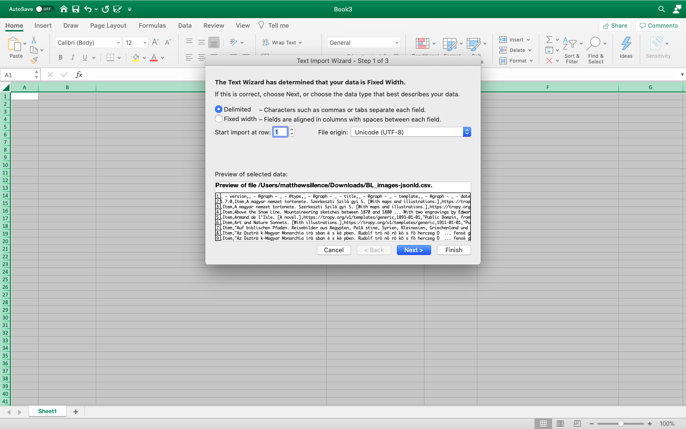

In the following window, select 'Comma' as the delimiter and click 'Next'.

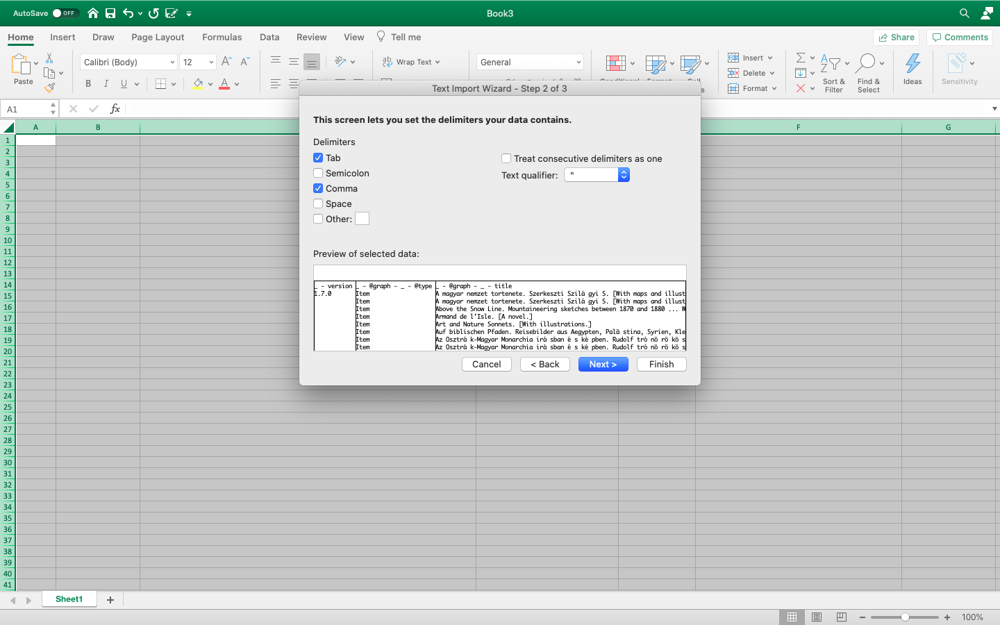

The final step will allow you to change the column data format, e.g. 'general', 'text', 'date'. Select 'general' and click 'Finish'.

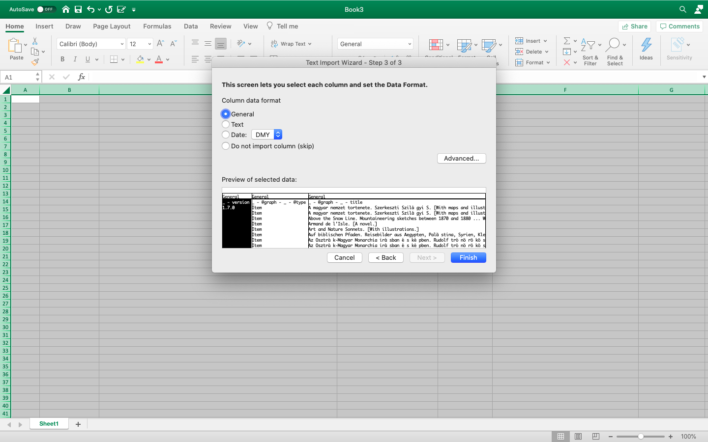

The imported data should consist of 47 columns, of which 30 have consistent records. You may notice some errors in the data, such as the ' _-_ @graph _-_  - date' and ' - @graph - \_ - photo - \_ - date' columns, which can be corrected by changing the column's data format.

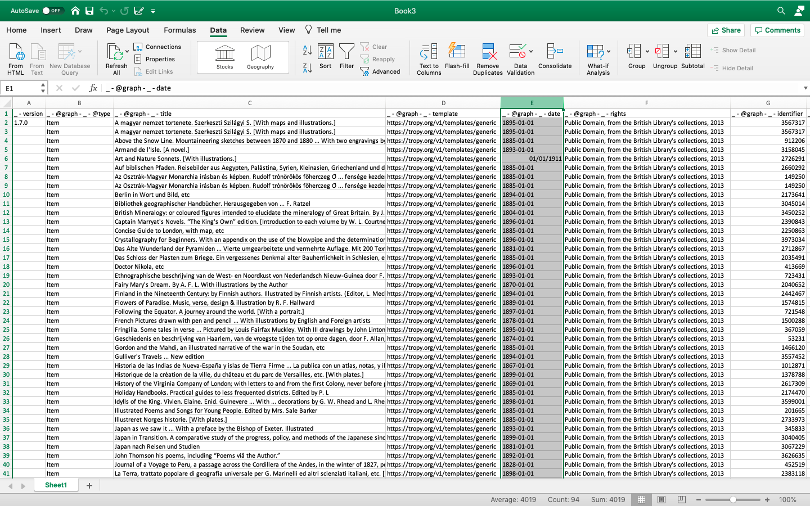

Select the relevant columns, then 'Format Cells' and choose a [standard date format](open-refine.md#9-standardizing-dates). 

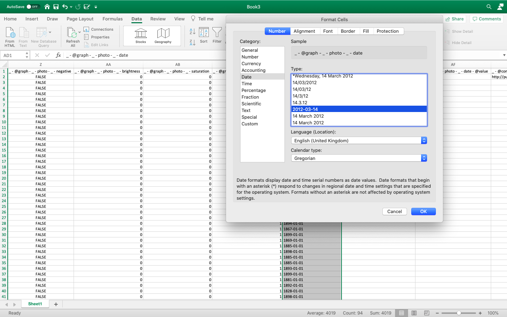

## Manipulating the Image Metadata

As you explore the data set, you will see that there are image dimensions: height and width. There is also a column containing 'size'. This refers to the file size \(in bytes\) rather than the dimensions of the images \(height x width in pixels\).

To generate the image dimensions, insert a new column close to the existing values, call this 'image\_dimensions' and use the auto sum function to multiply the values in the height and width columns. For example:

```text
=SUM(O2*Q2/1000)
```

In this example, we are dividing the area by 1000 provide a more manageable value, which will be more legible when creating a chart in this next section.

Repeat this formula using the 'Fill down' function in the new column.

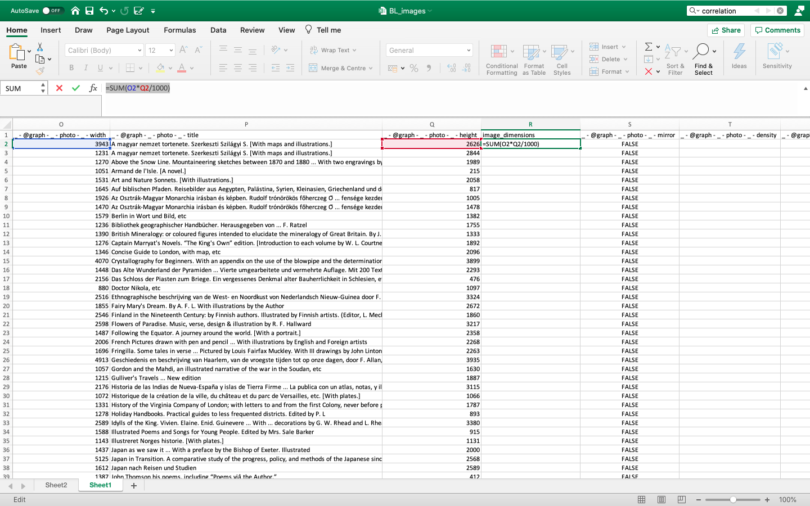

## Pivoting the Data

As noted in the earlier sections of the workbook, we can use Microsoft Excel to pivot the data using metadata from both the document records of the British Library \(the publications\) and the the digital images themselves.

Create a new pivot table using 'Insert' &gt; 'Pivot Table'. Ensure that the full data set is selected and create as a new worksheet. Click 'OK'.

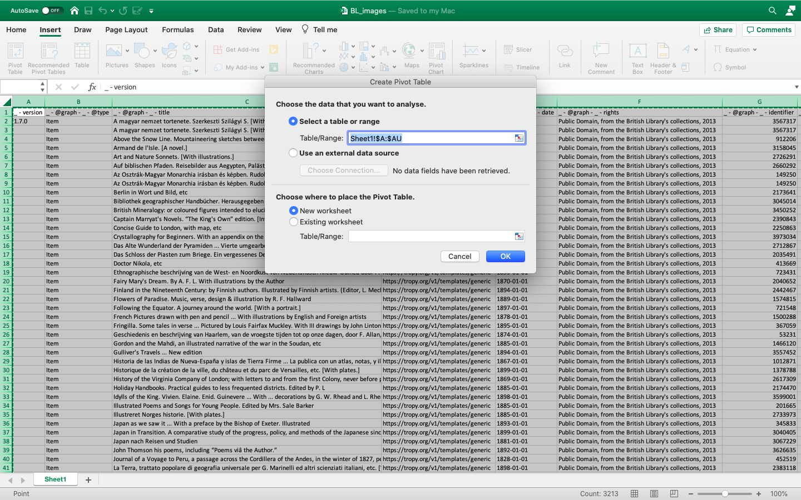

Using the pivot table fields, we will select two key features of the British Library's digital images: image dimensions and a unique file identifier. In the 'Rows' field add 'image\_dimensions', then the 'Values' field, add '-@graph-\_-photo-\_- checksum', but ensure this is set to 'Count of' rather than 'Sum of' by changing the field settings.

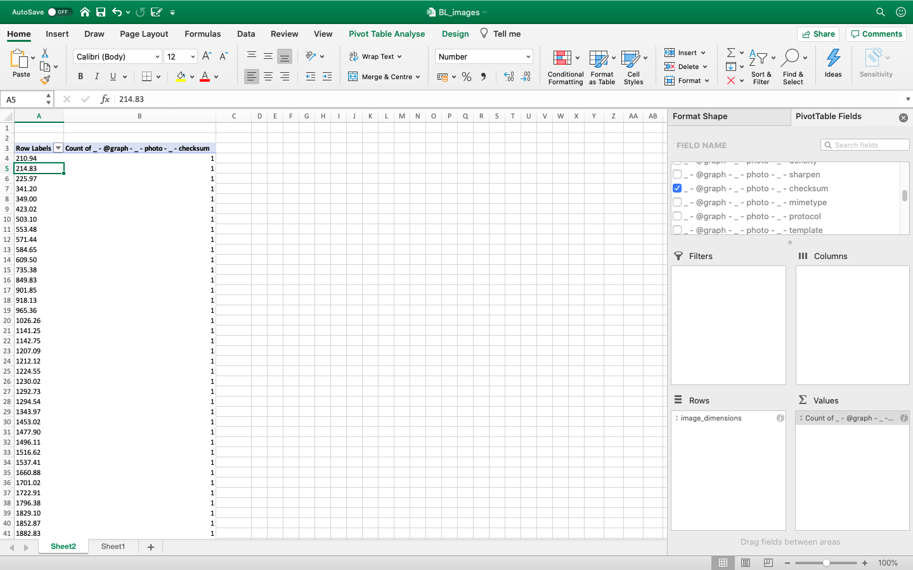

The digital dimensions of the images in this dataset can be analysed in terms of their distribution using a histogram. This might be useful when dealing with large-scale digitisation projects where digital objects such as these have been removed from the digital version of the printed publication and can vary in size.

Excel's pivot table feature does not allow the creation of of histograms as part of its preset charts, but there is a way of using a standard bar chart to perform the task.

### Creating a Histogram

The first step is to create a series of 'bins'. These are groups of values, such as date ranges. In this case, we will be creating groups of 1000 pixels.

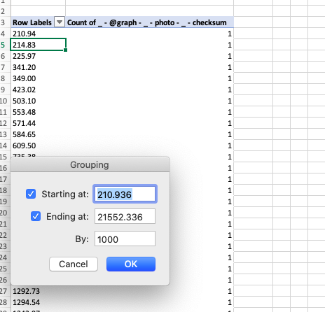

Right click \(or Ctrl + click\) on any value in the left-hand column in the pivot table and select 'Group'. You should see the starting and end values of image dimensions. Click 'OK' and this will now group the values into 15 'bins'.

Next, on the menu bar above, click 'Insert', then choose the basic '2D column' chart.

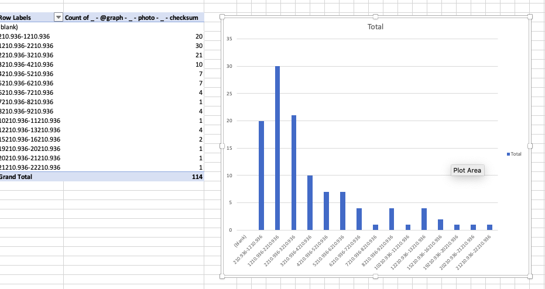

Now, select the bars of the chart and open the editing option 'Format Data Series'. Open the 'Series Options' tab and using the 'Gap Width' scale, drag this left to 0%. This should remove the gaps between the bars in the chart.

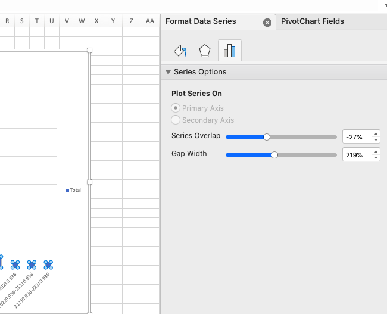

The resulting histogram will be right-skewed, which indicates a substantial amount of images that are quite small, which might be consistent with images from printed texts that served as illustrations rather than full prints in their own right. Performing this kind of check on sets of digital images could also indicate where there may be artefacts of the data capture: in this case the digitisation project itself.

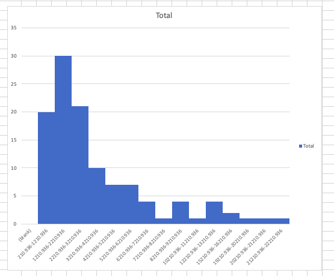


