# Open Refine

## Acknowledgements

This workbook could not have been produced without the training and guidance provided by Dr Elizabeth Wickes of the School of Information Sciences, University of Illinois at Urbana-Champaign, support from Dr David King and Dr Francesca Benatti of the Open University (UK), Dr Louise Atherton, University of East Anglia, and funding provided by the Consortium for the Humanities and the Arts South-East England (CHASE).

The activities in this workbook are based on the key principles for using Open Refine published by Professor Ruben Verborgh, Ghent University and Dr Max de Wilde, Université libre de Bruxelles. The dataset is provided by the British Library (UK), specifically Lorenza Gianfrancesco and Simone Testa, directed by Jane Everson, Denis Reidy, Lisa Sampson, assisted by Thomas Denman, Italian Academies Database: [https://www.bl.uk/catalogues/ItalianAcademies/](https://www.bl.uk/catalogues/ItalianAcademies/) (funded by the Arts and Humanities Research Council, UK, Resource Enhancement Grant, 2006-9, ref. AH/D00117X/1, and Major Research Grant, 2010-14 ref. AH/H023631/1).

All errors are my own.

Matthew Sillence

January 2019 (updated April 2020)

## 1. Introduction

Open Refine ([http://openrefine.org/](http://openrefine.org)) is a very helpful tool for researchers in a range of disciplines who want to manipulate and normalize data for further analysis. Data comes in many forms, ranging from the HTML from a webpage copied and pasted into a text file, to columns of rows of data as displayed in many familiar spreadsheet packages, or anything in between.

Even highly structured data, such as XML, are only as good as their source. Where human data entry is involved, and in many cases where transcriptions are automated, such as optical character recognition (OCR) texts, errors are common and can seriously affect overall data quality, and therefore the analyses we, as researchers, intend to perform.

The first stage of dealing with data is preparation, and this involves a lot of exploratory work, called **data profiling**, to determine where the most common issues are, and what needs to be changed to improve data quality. Crucially, manipulating datasets in Open Refine is an **iterative process**. It is important to exercise patience in this process. Open Refine can automate many tasks that would take a long time to do by hand, but rarely are such changes (known as **transformations**) entirely automated: you will need to make choices about what to change, how and why.

This workbook is designed for researchers in the arts and humanities and social sciences who are working with messy data. These might be data you have created or inherited, and requires some manipulation to be analysed effectively for your research. This example dataset used in this workbook is from the British Library, and is quite specific to certain disciplines. Extension activities to the workbook will be produced over time to explore different datasets and different functions of Open Refine, such as reconciliation and fetching and parsing HTML.

### 1.1 Downloading and Installing Open Refine

To download and install Open Refine, navigate to [https://openrefine.org/download.html](https://openrefine.org/download.html) and follow the steps for your device (Mac, Windows, Linux). Open Refine is installed on your device, but will use your web browser as an interface.

## 2. The Dataset

The dataset that will be used for this session is quite structured, but many others are less so. The aim here is to allow you to explore data and better understand its requirements, and the various transformations you are able to perform using Open Refine. Datasets usual have different licences. In this workbook we will use a public dataset, which is available through the British Library:

The Italian Academies Project Database (XML Records)

[https://data.bl.uk/iad/iad1.html](https://data.bl.uk/iad/iad1.html)

We are free to view and manipulate the data from this project, but please remember to cite the source: Lorenza Gianfrancesco and Simone Testa, directed by Jane Everson, Denis Reidy, Lisa Sampson, assisted by Thomas Denman, Italian Academies Database [https://www.bl.uk/catalogues/ItalianAcademies/](https://www.bl.uk/catalogues/ItalianAcademies/) (funded by the Arts and Humanities Research Council, UK, Resource Enhancement Grant, 2006-9, ref. AH/D00117X/1, and Major Research Grant, 2010-14 ref. AH/H023631/1).

This dump of data from a database is a good example of something that does not necessarily contain instructions on how the data were collected, or how consistent they are. It is a bit like having a very sketchy map to a territory. When you are on the ground, you need to understand what the landscape is really like: what are the obstacles and the paths that you can follow? Where do they lead?

## 3. Parsing XML: Structured Data

Download the whole dataset from [https://data.bl.uk/iad/iad1.html](https://data.bl.uk/iad/iad1.html) as a .ZIP package. Extract the contents, which you will see appear in .XML format. Save the folder and its files in an accessible area in your file directory.

Now, navigate to Open Refine on your desktop and open the application. A browser window should open with the Open Refine homepage.

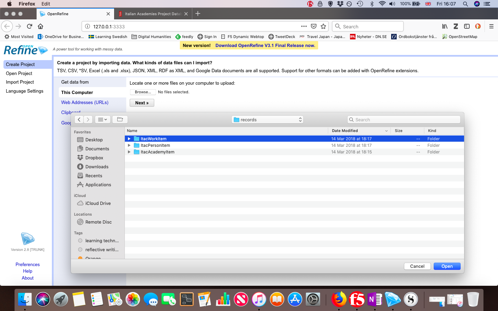

Click on ‘Browse’ and find the folder called **ItacWorkItem** containing the XML files for all of the publications related to the Italian academies. There are other datasets here: people connected with the academies, and records of the academies themselves, but for the purposes of this exercise, we are just going to focus on the publications recorded by this project.

Open the folder and select all of the XML files (you can choose ‘select all’ from the menu under ‘Edit’ to speed up this process if you prefer). When they have been selected (it should read ‘911 files selected’), click on ‘Open’, then 'Next' to start the import.

You should see a list of all of the files that will be imported into Open Refine.

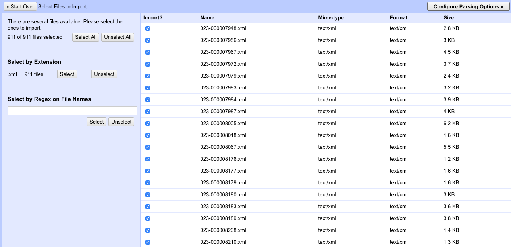

Click on ‘Configure Parsing Option’.

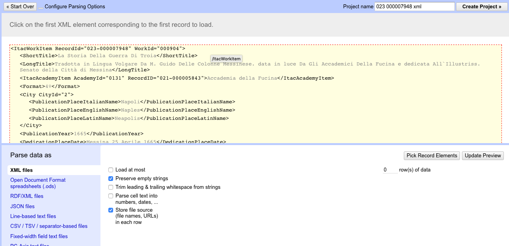

You should now see a preview of the XML itself appearing in the top window, and a series of options below to help Open Refine parse the data (which means here, to read and order the XML structure into something that can be manipulated).

Use your cursor to hover over the whole XML block until it shows that it is selected. This should change the preview so that the data are now tabulated, similar to a normal spreadsheet layout.

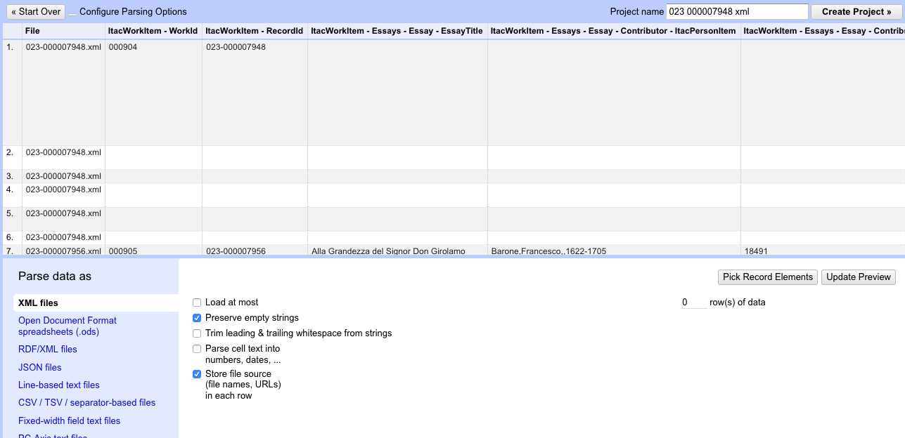

Now, click on ‘Create Project’ in the top right of the page. After a few seconds, Open Refine will create your project, and you will see a table with 4464 rows.

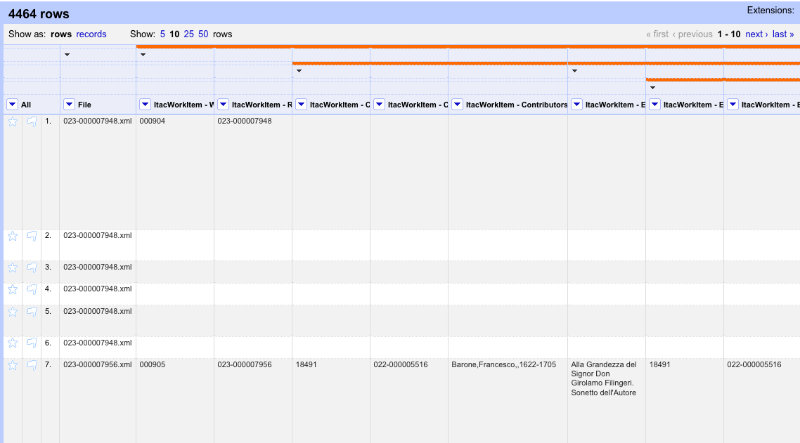

### 3.1 A Note on Character Encoding

When importing your own datasets (or those of others) into Open Refine, there is one important setting that requires attention before creating the project, and that is for the character encoding.

CSV and TSV (tab-separated value) files may be encoded in UTF-8, but Open Refine needs to be told that this is the encoding. Useful descriptions on how to set this can be found here:

[https://librarycarpentry.org/lc-open-refine/02-importing-data/index.html](https://librarycarpentry.org/lc-open-refine/02-importing-data/index.html)

The example below is from a text file, and you can see the ‘Character encoding’ option.


Just select the relevant encoding (in this ‘UTF-8’) and you will be prompted to check and create the project.


## 4. Data Profiling

That is a lot of rows! A lot more than the 911 records that were supposedly imported. What is all this extra stuff? Well, some of these rows relate to people connected with the publications - in this case, not the author but the person to whom the work was dedicated. Scroll across the table and you may see a number of names of ‘Dedicatees’ listed, which relate to the work.

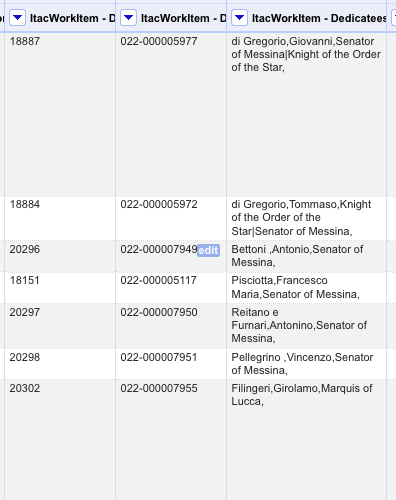

This gives us an indication that the dataset was likely part of a relational database (these people probably belonged in a separate table, and were linked to the works). When the file was outputted as XML, these records were also included (you can view the raw XML to see the ‘dedicatee’, but also other people, such as ‘censors’ or ‘illustrators’ who may have been involved in the work in some way.

For this exercise, we are going to ignore these related records, and just focus on the 911 works that is the core of this dataset. This is a modestly sized dataset, and effectively it is just bibliographic metadata, but a good amount to test out a number of key functions of Open Refine. It is also quite well structured - that is thanks to the XML - so when can more easily manipulate it.

However, a structured dataset does not always mean a _clean_ dataset. As you begin to explore it, you will notice that there are many things that are far from standardized, and might make it difficult to conduct meaningful analysis in the future. The first step, before we transform the data is to do some data profiling, which means figuring out what the most obvious issues are.

Bibliographic metadata contains some essential parts, normally the author or creator of the work, the title, the date and place of publication, and some indication of the contents, such as subjects. This particular project was also clearly interested in other aspects of works connected with the Italian academies, such as dedications in the texts, and the people mentioned in them.

If we take these parts of the metadata (which in the original database would have appeared as fields), we can see that they occupy several columns in the dataset as displayed in Open Refine. Scroll along the top line to see the column headers. You can place your cursor on each column header to view the column name in full.

As you explore the dataset, you will notice that there are in fact several names that appear as records in this dataset. The first one is listed as ‘Contributors’, but you will also see an ‘Essay - Contributor’ column as well, which is useful if there is more than one author in a collection of works. As already noted, there are also ‘Censors’ and ‘Dedicatees’.

For the purposes of our first data cleaning task, we will focus on ‘Contributors’. To begin with, we start data profiling by creating a data facet, but before doing so we need to focus in on those 911 works, rather than the related records mentioned above.

## 5. Faceting

Usefully, each work item has a unique number (‘WorkID’ in the column headers). We will use that to exclude the records that are simply related data. To do this, first click on ‘Show as:’ above the columns and click on ‘records’. Click on the drop-down arrow to the left of the ‘WorkID’ column and select Facet > Customized facets > Duplicates facet.

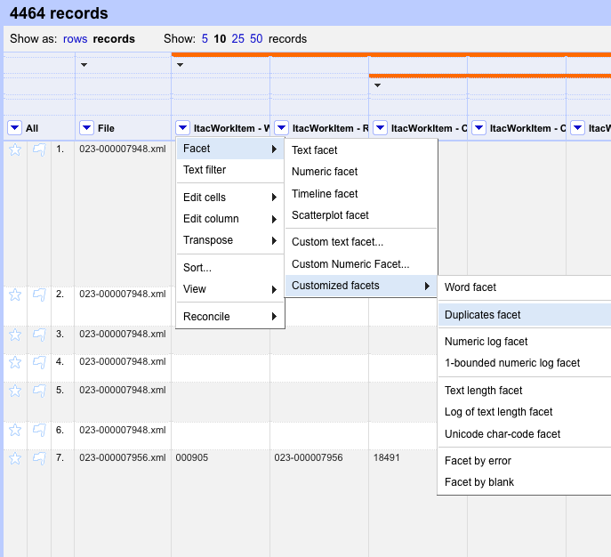

This should open a panel on the left hand side of the browser window, which displays to choices: ‘false’ and ‘true’. The records listed as ‘true’ are all blank (they have no WorkID value), so are considered duplicates. Those which are ‘false’ are all of the unique records - the items we are interested in.

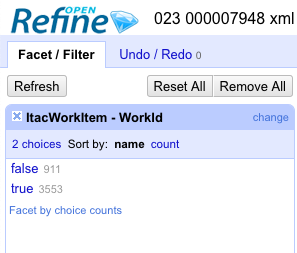

To exclude the 3553 blank items, place your cursor over ‘false’ and click on the link ‘include’ that will appear on the right. You will see that we now just have 911 records.

N.B. This has not deleted the data. Only transformations made to the data can remove records. In a sense, we have just emphasised one facet of the dataset to work on for now, and this is a very helpful function of Open Refine. It means that we can focus on different aspects at different times.

Now we have focused on the 911 items, we need to look at the way that the data have been inputted into the relevant names columns. Remember that these are not called ‘names’, but are in fact considered as ‘contributors’. Looking at the first ‘Contributor’ column on the first record, we can see that there is no known contributor to that work (the cell is blank), but there is a censor and there are dedicatees. There is an 'Authors' column.

Looking more closely at the format of the name, we can see how it has been entered: ‘Mariani,Mario,,1634-1709’. This may have been deliberate, to follow a standard of values separated by commas, but we need to know more about the way personal names have been created in this dataset as inconsistencies in spelling or formatting may lead to problems later on.

One of the ways of understanding where the errors might be is to run a facet on the the ‘Authors' column. As before, click on the drop-down box on this column, and select Facet > Text facet. Another panel will appear on the left hand side of the screen with 261 choices. These are the 261 contributors that appear in the records.


In general, the comma-separated format seems consistent, but you may notice that some of the date ranges of the contributors and their titles are formatted in slightly different ways. For example, you might have spotted the spacing either side of the hyphen (or what is sometimes termed an ‘en dash’) in a date range (e.g. ‘1622 - 1668’ versus ‘1607-1681’) or the use of a vertical line between titles (e.g. ‘Cibo,Carlo,Marquis of Carrara|Duke of Aiello,1581-1662’).

The author data, therefore, is not particularly standardized. If we wanted to analyse these names accurately, we need to ensure that they are normalized.

## 6. Clustering

One way of approaching normalization is through **clustering**. Clusters are powerful tools in Open Refine, and provide a a way of grouping similar, but not identical, values across a dataset and summarising them so that changes can be made to the cells. It is not entirely automated - you still need to make decisions about how to transform the data - but it is much quicker than scrolling through 911 records looking for similarities and differences.

From the facet pane, click on the ‘Cluster’ button and a new window will open.


You may have a message that says ‘No clusters were found with the selected method’. To change the sensitivity, we will use an ’n-gram fingerprint’ method. You can learn more about the theory behind this method and others here: [https://github.com/OpenRefine/OpenRefine/wiki/Clustering-In-Depth#n-gram-fingerprint](https://github.com/OpenRefine/OpenRefine/wiki/Clustering-In-Depth#n-gram-fingerprint).

N-grams are those text strings of values (in this particular case, characters) that can be matched in datasets. Open Refine is using them as a probabilistic model, and this method is helpful because it returns more false positives than the standard fingerprint method, so you are less likely to miss errors.


You should see that there are now several examples of names that have appeared in the window. These are bigrams (n=2). Open Refine has managed to find ten potential clusters of very similar names, and you can even see how many rows in the data table are affected in brackets next to each clustered value.

We have a chance to correct these values so that they follow a standard. Clicking on the ‘New Cell Value’ field allows you to define how you would like the new values to appear in all of the affected cells. For this purpose, we will stick with the comma separated approach, and also close the hyphenation so that the dates are linked with no white space between them. For example: ’De Tarsia, Pablo Antonio , Abbot‘ becomes ‘De Tarsia, Pablo Antonio, Abbot’ and ‘Della Porta,Giambattista,,1535? - 1615’ becomes ‘Della Porta,Giambattista,,1535?-1615’ (to ensure that the double commas remain in place).

Make the necessary changes to each value and ensure that the ‘Merge’ boxes are selected. Then click on ‘Merge Selected & Re-Cluster’. Open Refine will tell you that it has edited 51 cells.

You will also be able to see that the number of ‘Authors’ faceted has changed from 432 to 422 because ten clusters have been amended and corrected. Have a look through the list of other names and see if there are any other errors or inconsistencies that you would want to correct.

## 7. Exploring Facets: Titles

A different facet of the dataset that we will explore now is the title of publications. You will see that these have been entered into the database in different ways. There is a ‘ShortTitle’ column and a ‘LongTitle’ column, in addition to a column that deals with the essay titles. For now, we will just focus on the short titles and long titles.

Perform a text facet and cluster on the ‘ShortTitle’ column, and then compare the results of a **key collision** using the standard fingerprint and n-gram fingerprint methods. You will notice that the standard method has produced slightly more results than the n-gram method this time (26 to 25). We will use the higher number of clusters (which are still manageable) and examine the values in each cluster. What do you notice about them?

‘Lezioni Intorno Alla natura Delle Mofete’ appears three times, but it is not so clear where the issue lies with these records. The short titles all look the same. Click on ‘Browse this cluster’. You will now see that the table has just selected the three relevant records.

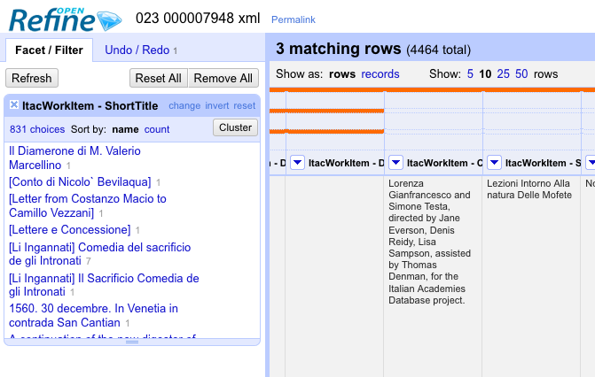

Just looking at the column values for these three records does not reveal where the error lies. One of the most common issues with data within cells is - as we have seen - errors in data entry. This particular error is not easily visible within Open Refine because it is a result of **whitespace**. Whitespace occurs when a space is entered into the cell before or after the values. These are often invisible in Open Refine, but can affect the number of unique values. So, instead of one short title, we have three short titles. One without whitespace and two that likely have it either before or after the words in the title.

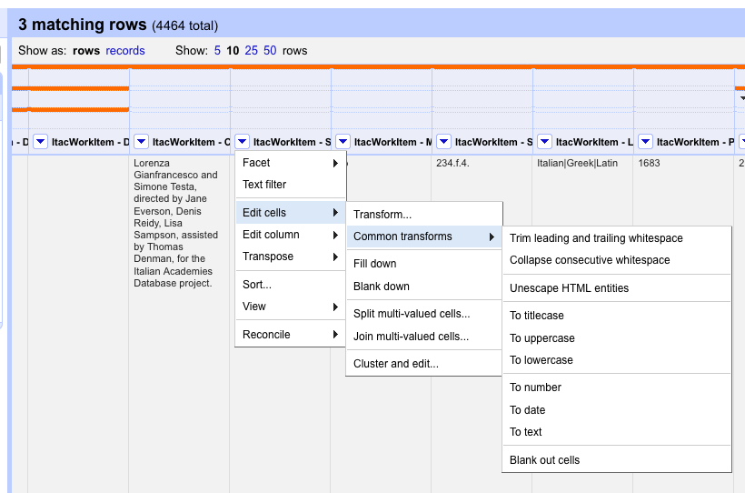

Luckily, Open Refine has a built-in function for removing whitespace from cells. Click on the drop-down box in the ShortTitle column and select Edit cells > Common transforms > Trim leading and trailing whitespace. Open Refine should display a message to say that it has made 2 changes to the data.

Close this tab with the affected records and return to the main Open Refine tab. Re-run the cluster on the ShortTitle column, and you will notice that the cluster for the title ‘Lezioni Intorno Alla natura Delle Mofete’ has disappeared. You will also see that if you re-run the facet summary, there will now be 3 records listed under the same title.

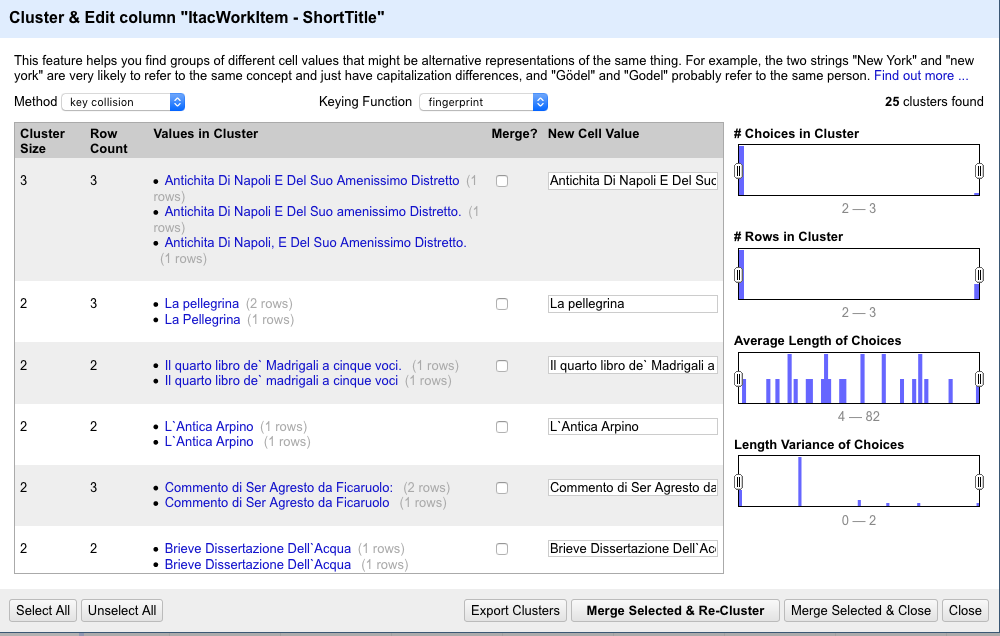

If you like, you can explore the remaining 25 titles and decide on how to merge these so that they are consistent. You can repeat this process with the LongTitle column as well if you have time. Well done! We are now closer to having a cleaner dataset.

## 8. Transforming Multi-Value Cells with GREL

Let us now look at the next facet of our dataset: the year of publication. A text facet reveals that most of the values seem to be just a year, and occasionally there is notation to indicate approximation or possible incorrect years. This is not particularly complex. But what happens if we wanted to know about the dates of the dedications that were mentioned in these works? The researchers on this project saw fit to record, not only the date of the dedication, but the place. Unfortunately, unlike the ‘PublicationYear’ column, we have several values in the same cell, often called **multi-value cells**.

Navigate to the ‘DedicationPlaceDate’ column and explore the column data through a text facet as before.

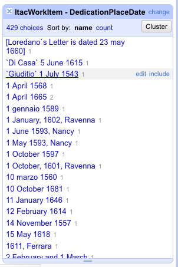

This is quite complex. There are 429 distinct values in this column, but there are many different forms of data. At the top of the list there is what looks like a free text note with a date, some records have just a date (in English, but sometimes in Italian), and further down the list, the place is mentioned before the date.

If we wanted to analyse the places and dates of dedications in these texts, it is going to take some work to structure them in such a way that they can be read effectively. How can we do this?

Just clustering and merging the values will not be enough as we are not really looking for duplicate values, we are looking to create a consistent structure, or preferably, to separate the values into distinct columns (as we had with the ‘PublicationYear’).

To do this will require some work on the whole column. The simplest tool to break apart a multi-value column of data is to use the ‘Edit column’ function under the drop-down menu, then select ‘Split into several columns’.

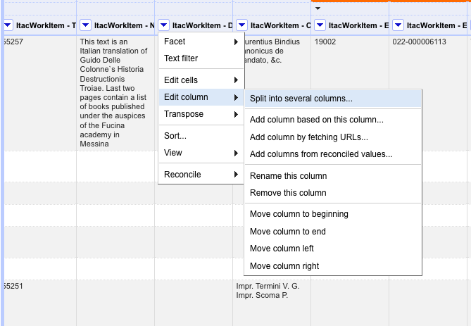

For the purposes of this exercise, we will try to break apart that place and the date; the date here referring not just to a year, but also the month and day where known. The ’Split column’ function has several options. You can split by a separator, which can be a specific a character or even a space. As the values in this column are separated by spaces, e.g. ‘Messina 25 Aprile 1665’, Open Refine will attempt to split the value at that point and move the following value(s) into a new column. By default, each separated value will be placed in a new column, but in this case we only want to separate the values into place and date. By limiting the column split to 2 columns, Open Refine will all values after the first separator into the same column.

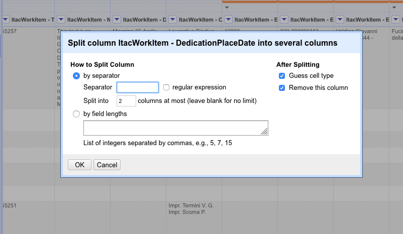

You should now have two columns: ‘DedicationPlaceDate 1’ and ‘DedicationPlaceDate 2’. Now look at list of values in the columns by running a text facet on each column. You will notice that the column that now contains the place data also contains lots of numbers and other details that are not necessarily place names. Most of these are likely to be parts of the date if there was no dedication place in the work, or if the person who entered the data accidentally keyed in the place after the date rather than before it.

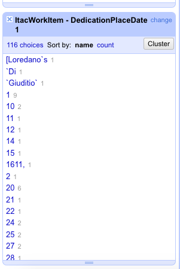

We need to join together these values with the new dedication date column that we have created. To do this we will need to use a more specific method, known as **Regular Expressions** (‘**Regex’** for short).

A useful Regex is `^\d` which can be used to filter cells that only start with a digit (which is what we are concerned with here). From the ‘DedicationPlaceDate 1’ column, click on the drop-down box click ‘Text filter’ and a panel will appear on the left-hand side of the screen.

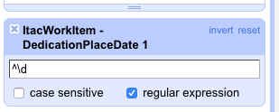

Enter the Regex in the box and ensure that you select the ‘regular expression’ option so that Open Refine recognises it. You should now see have 50 records displayed in Open Refine: these will be only those records that had a digit in the ‘dedication place’ column. We now need to make changes to these records.

Click on the drop-down box in the ‘DedicationPlaceDate 2’ column and select Edit cells > Transform.

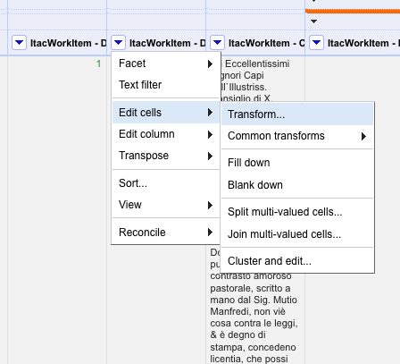

Regexes can be customised to the display data or transform it in different ways. Open Refine also uses its own **General Refine Expression Language** (**‘GREL’**) that can be used with Regexes. Further information on how these expressions languages work can be found here:

[https://github.com/OpenRefine/OpenRefine/wiki/Understanding-Regular-Expressions](https://github.com/OpenRefine/OpenRefine/wiki/Understanding-Regular-Expressions)

[https://github.com/OpenRefine/OpenRefine/wiki/General-Refine-Expression-Language](https://github.com/OpenRefine/OpenRefine/wiki/General-Refine-Expression-Language)

GRELs can be used on the values found in cells. The expression below indicates where the data are (the cells related to the first column containing the dedication place), what to do with the data (find the values and add them to the values in the second column). Enter the following text into the box:

```
cells["ItacWorkItem - DedicationPlaceDate 1"].value + " " + cells["ItacWorkItem - DedicationPlaceDate 2"].value
```

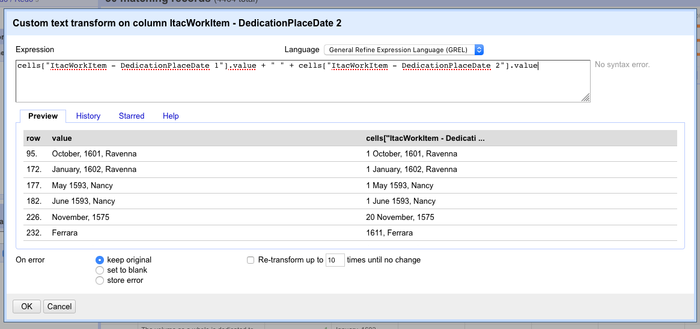

The use of quotation marks indicates the name of something (here the column names), but also any additional data such as spacing (here, the value is added to the next column, but the “ “ indicates that a space will be inserted before the values in the second column).

After this transformation is made, you will notice that the values in the first dedication place column have been copied into the new column, but we are still left with a value in the first column. We will need to remove these.

With the text filter still set (so we only make changes to the relevant records), use the drop-down menu on the first column (‘DedicationPlaceDate 1’) and select Edit cells > Transform and enter the following expression:

```
cells["ItacWorkItem - DedicationPlaceDate 1"].value - ""
```

This should remove the digits in the 50 filtered records. It may appear that all the records have deleted when the operation completes, but this is a bit deceptive because the filter is still active. Navigate to the left-hand side of the screen to delete the filter and you should see all 911 records again.

Select the drop-down box on the ‘dedication date’ column and select Facet > Customized facets > Word facet to explore all of the words in the cells in this column.

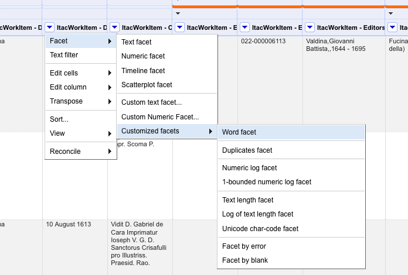

Scrolling through the numbers and words that have been returned, you will notice that there are several unusual forms of dates taken from the dedications in these works. Some are in English, some in Italian, and some in Latin. This is unsurprising given the nature of the historical material, but not too helpful if we wanted consistent date ranges when we analyse these works later.

## 9. Standardizing Dates

International standardization of dates is actually quite simple in Open Refine, but much easier if the month is in English (we can debate the ethics of this later!). This is going to require some semi-manual work. The first task is selecting all of the relevant months from the word facet so that we concentrate on only those records which need transforming.

For our first example, we might select ‘April’, and in this case we can see that there are several versions in the word facet: ‘April.’, ‘aprile’, ‘Aprile’. The first has a full stop at the end and the second and third words are respectively lower- and uppercase versions of the month in Italian.

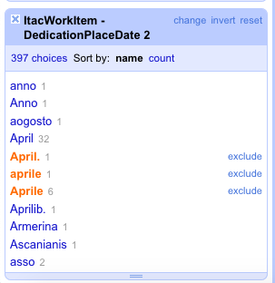

Select those versions of ‘April’ by clicking ‘include’. This will filter out the other records in the dataset. To instruct Open Refine to replace these words, rather like clustering, we need to define them and edit the cells. The following expression can be used to replace all of these words with the standard form in English ‘April’. Go to Edit cells > Transform and enter the following expression:

```
value.replace("Aprile", "April").replace("aprile", "April").replace("April.", "April")
```

You can repeat this expression, filtering and inserting other months, e.g. ‘agosto’ for August into the expression.

N. B. You will notice that there are several descriptions of the dates that are difficult to convert because they refer to a particular reign or feast day in history. This is impossible to semi-automate, so for those few examples you would need to manually convert the date into a modern form using a historical dictionary.

Similarly, you may find some ‘dedication dates’ that have a miskeyed place following the date. If there are only a few of these, you can type the place manually into the ‘dedication place’ column, or you can use a GREL expression to reverse these examples before splitting the original column data into two columns.

To standardize the date column, navigate to Edit cells > Common transforms > To date.


This should transform any legible dates into the international standard, which takes the following form: YYYY-MM-DD HH:MM:SS (year, month, day, hours, minutes, seconds). For example: 1665-04-25T00:00:00Z.

## 10. Exploring Facets: Subjects

Okay, so that’s pretty complicated stuff. So far we have covered faceting, clustering, column and cell transformations and a few basic GREL expressions. The last section of this workbook will focus on other metadata associated with these works, namely the subjects of the works themselves.

Whether it is bibliographic data, museum collections or legal documentation there are likely keywords or subjects that are used to index items. Ensuring that the subjects are consistent (often known as ‘authorities’) can be very important. For example, the Library of Congress uses subject headings and authorities which all catalogue works employ to facilitate classification and retrieval. See [https://www.loc.gov/aba/publications/FreeLCSH/freelcsh.html#Introduction](https://www.loc.gov/aba/publications/FreeLCSH/freelcsh.html#Introduction) for further information.

The Italian Academies dataset also contains subjects. We cannot be sure where these subjects came from, but a library catalogue is a possibility. We will start by exploring them.

First, ensure that you have removed any other filters from the previous exercises, apart from the initial facet that shows the 911 works. Navigate to the ‘Subjects’ column in the dataset and run a word facet on the column.


When the word facet panel opens, you should see 496 choices. That is quite a lot of subject headings. If you look closely at the list, it is also quite deceptive, because this is not 496 distinct terms, but in fact several aggregated terms that have been brought together because there is no clear division between the words in the cell. In short, these are multi-value cells, rather like the names and dedications we explored earlier.

Many of these multi-value cells contain the vertical bar “|”, which will need to be removed. To better see and facet the words perform a cell transformation on this column with the following expression:

```
value.replace("|", " ")
```

This will remove the vertical bars and insert a space between each word. This should change 231 cells, changing the word facet to 385 choices. Looking down the list of words, this seems easier to read and, potentially, analyse.

## 11. Exporting to CSV

When you have amended and normalised the required facets of the dataset, you will need to make a choice about what to export for further analysis. One of the best features of Open Refine is its flexibility with importing data in different formats and being able to export to many different formats. Among the most interoperable will be the comma separated value (CSV) file format, which can easily be manipulated in most spreadsheet packages, including Excel. It is also useful for Open Refine if you find that you need to do more work on data cleaning later on.

For a wide variety of choice about what to export (because there are a lot of cells in this dataset that contain values), go to the ‘Export’ button at the top right-hand side of the screen and select ‘Custom tabular exporter’.

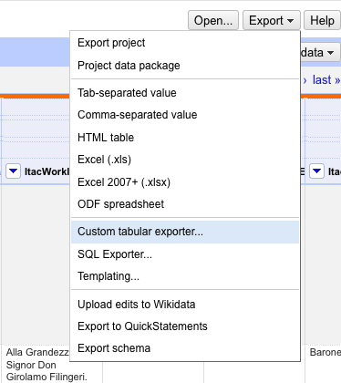

This will open a new window with a series of options about which columns of data to export. Start by ‘de-selecting’ all of the columns for export.

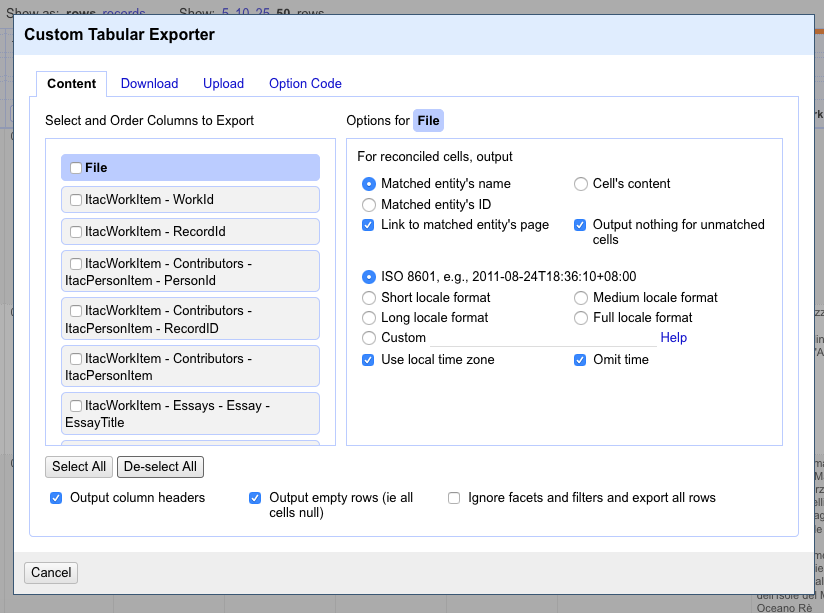

Based on the exercises in this workbook we will select the following:

* Contributors - ItacPersonIteam
* ShortTitle
* PublicationYear
* Subjects
* DedicationPlaceDate 1
* DedicationPlaceDate 2

Click on the ‘Download’ tab in the window and select the CSV format.

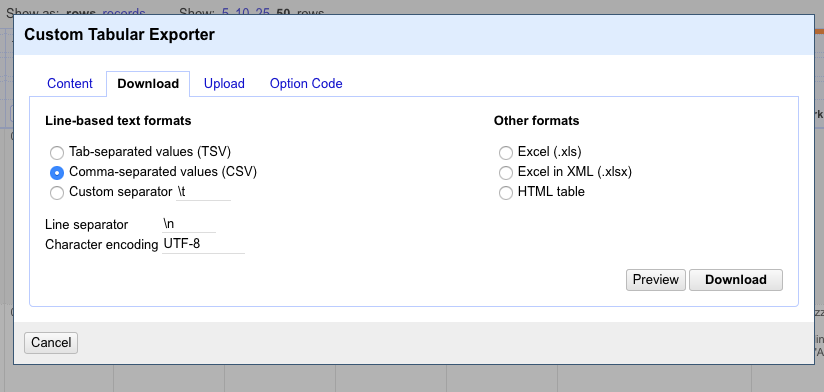

Click on the ‘Download’ button and save the file to a folder on your device.

## Extension Activities

From the web (HTML)

[https://programminghistorian.org/en/lessons/fetch-and-parse-data-with-openrefine](https://programminghistorian.org/en/lessons/fetch-and-parse-data-with-openrefine)

### Semi-Structured/Unstructured Data: Lists from OCR texts (.txt)

Clerical directories and subscribers’ lists from the Internet Archive: [https://archive.org/stream/crockfordscleri00finagoog/crockfordscleri00finagoog\_djvu.txt](https://archive.org/stream/crockfordscleri00finagoog/crockfordscleri00finagoog\_djvu.txt)

[https://archive.org/details/amanualmonument01haingoog/page/n7](https://archive.org/details/amanualmonument01haingoog/page/n7)

Guidance: [https://github.com/matthewsillence/antiquarian\_networks](https://github.com/matthewsillence/antiquarian\_networks)

### Reconciliation and Linked Data (RDF ad SPARQL)

Normalizing data might also involve referring out to standard values. Open Refine has the capacity to link to web-based services and finding authorities to reduce the ambiguity in the data. The caveat is that the process is quite slow, and only semi-automated, so some human work is still required.

[https://github.com/OpenRefine/OpenRefine/wiki/Reconciliation](https://github.com/OpenRefine/OpenRefine/wiki/Reconciliation)

### Enhancing Data

Geo-coding through Open Refine:

[https://blog.ouseful.info/2013/02/20/geocoding-using-the-google-maps-geocoder-via-openrefine/](https://blog.ouseful.info/2013/02/20/geocoding-using-the-google-maps-geocoder-via-openrefine/)

[https://schoolofdata.org/2014/05/19/putting-points-on-maps-using-geojson-created-by-open-refine/](https://schoolofdata.org/2014/05/19/putting-points-on-maps-using-geojson-created-by-open-refine/)
