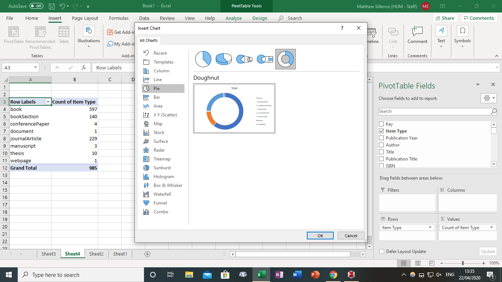

# Organising and Exploring Data

## Bibliographic metadata

Thinking carefully about your data can really pay off in the long term. Over the years, organisations have defined standards for creating and handling data. You are likely using some of these without thinking about it. For example, bibliographic management software, such as Zotero, handles metadata \(data about publications\) using certain [file formats](https://www.zotero.org/support/kb/importing_standardized_formats) so that references can be imported and exported easily, minimising the need to manually create entries or reformat them.

Take a few minutes to look through the following bibliographic data \(over 900 titles, 13341 lines of data\): [https://github.com/matthewsillence/PhD\_data/blob/master/sillence\_bib.ris](https://github.com/matthewsillence/PhD_data/blob/master/sillence_bib.ris)

Can you identify the abbreviations for each field in this data structure, e.g. 'AU'?

Can you spot any errors or problems with the data?

### Using Zotero to import and explore bibliographic data

When you have explored the bibliographic data, ensure that you have [downloaded](https://www.zotero.org/download/) Zotero onto your device.

Open Zotero on your desktop and create a new Library. Guidance can be found in the [quick start guide](https://www.zotero.org/support/quick_start_guide).

Navigate to the PhD data repository: [https://github.com/matthewsillence/PhD\_data](https://github.com/matthewsillence/PhD_data) and click on the 'Clone or download' button, then 'Download ZIP'.

Save the ZIP file to your device and unzip the contents.

From Zotero, select File &gt; Import and locate the file 'sillence\_bib.ris'. 

Although you can easily scroll through the list of bibliographic references and examine the quality of the metadata in greater detail, Zotero has considerable flexibility in exporting the metadata in different formats.

One of the most useful is the .csv format \(comma-separated values\).

### Exporting metadata from Zotero

From the main menu, select 'File' &gt; 'Export Library', then select an appropriate file format. For this exercise, we will use the .csv format. Select a location to save the file on your device. You can choose to export the notes for each entry if you prefer.

Now, open Excel or equivalent spreadsheet package on your device. As with Zotero, the .csv file needs to be imported into your spreadsheet application, rather than simply opened.

Start a blank workbook and, if using Excel, from the tabs at the top of the screen, select 'Data' &gt; 'Get Data' &gt; 'From Text/CSV'. Locate the .csv file and import.

The preview option allows the user to check if the metadata are located in appropriate columns, such as 'Item Type'.

### Exploring bibliographic data

Bibliographic metadata is not inherently meaningful for many researchers, other than serving a referencing purpose. However, analysing large quantities of bibliographic references for your research can provide a different perspective on your own research. For example, what are the proportions of item types in your research, e.g. the number of book sections to journal articles, or theses?

### Pivoting your dataset

Excel's 'pivot table' function can help your to explore large spreadsheets with multiple columns and values quickly, efficiently and allow you to produce graphical representations of the dataset as a whole.

From the worksheet with the imported bibliographic metadata, select 'Insert' from the top menu bar, then choose 'Pivot Table'. Ensure that the whole dataset is included in the table or range that will be selected, then click 'OK'.

Using the 'PivotTable Fields' list on the right-hand side of the screen, select 'Item Type' in the 'Rows' area, then drag the 'Item Type' option from the field list to the 'Values' area. This should generate a count of each item type in the dataset.

The counts of each item type can be represented graphically as well as numerically. From the menu bar above, select 'Insert', then 'Recommended Charts'. Choose your preferred chart type. For this example, we will use the 'doughnut' pie chart.

Select 'OK' to insert the chart into your worksheet.

There are a number of surprising features of this dataset. The first is the number of books, which is the most numerous item type \(61%\), followed by journal articles \(23%\), then book sections \(14%\). You can display percentages as data labels using the 'Design' tab in the menu bar.

### Exploring distributions in the data

One very useful way of exploring a dataset is to examine distributions in certain data categories. The second aspect of this bibliographic dataset that could be worth examining is the date of publications. For example, a research project that tackles a relatively new concept or phenomenon is likely to use more recent sources; a project that is historiographical is likely to include a wider range of publication dates. The most common data visualisation of distribution is the histogram, which categorises values in particular columns of data \(sometimes called 'bins' in data science\).

In this example, we will explore the dates of publication using decades as the 'bins' for the counts of items in the dataset. Unfortunately, the pivot table view in Excel does not allow the user to use the histogram function, so we need to create a workaround solution.

Inside the pivot table, right click on any cell in the 'Row Labels' column and select 'Group' from the menu.

A grouping window will appear. In the 'By' field, change the default value to 10. This indicates the number of years that the date ranges will be split into: the 'bins'. Now select 'OK'. You should see that the row labels now show date ranges rather than the specific years.

Create a new chart, using 'Insert' &gt; 'Chart', and select a columns chart type. 

In order to create a more convincing histogram, where the columns are placed immediately adjacent to one another, some modifications will need to be made its appearance. Right click on the chart and select 'Format Chart Area'. In the menu on the right-hand side of the screen, select 'Chart Options', then choose 'Series "Total"'. 

Navigate to the bar chart icon and then 'Gap Width' option, and drag the scale to 0%. This should reduce the gaps between each bar in the chart to 0.

In the resulting histogram, you should be able to see that the majority of publications in this research project belong to the period 1996-2005 \(301 items\). It is also worth noting that the study also relies on publications that date from the latter half of the nineteenth century. We can also see that there are several sources \(14\) that have no date mentioned at all \('blank'\), which may need further investigation.

Every research project will have a different number of sources, but the timeline histogram can be useful in providing a 'fingerprint' for your work, and an indication of over-reliance on scholarship from particular time periods. Earlier dates \(e.g. sixteenth-century\) would suggest that the study also includes primary sources.

