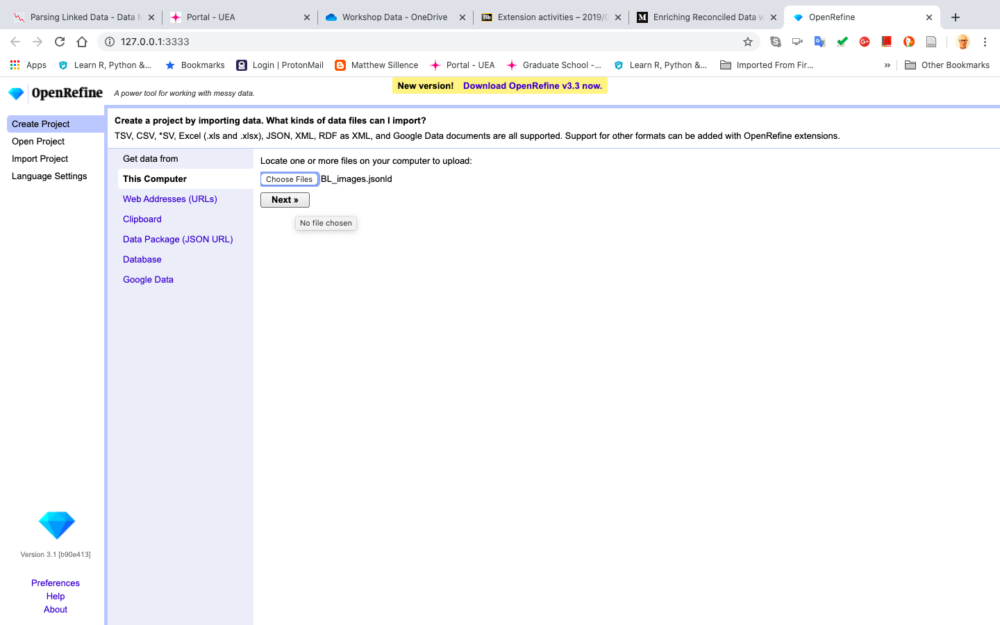
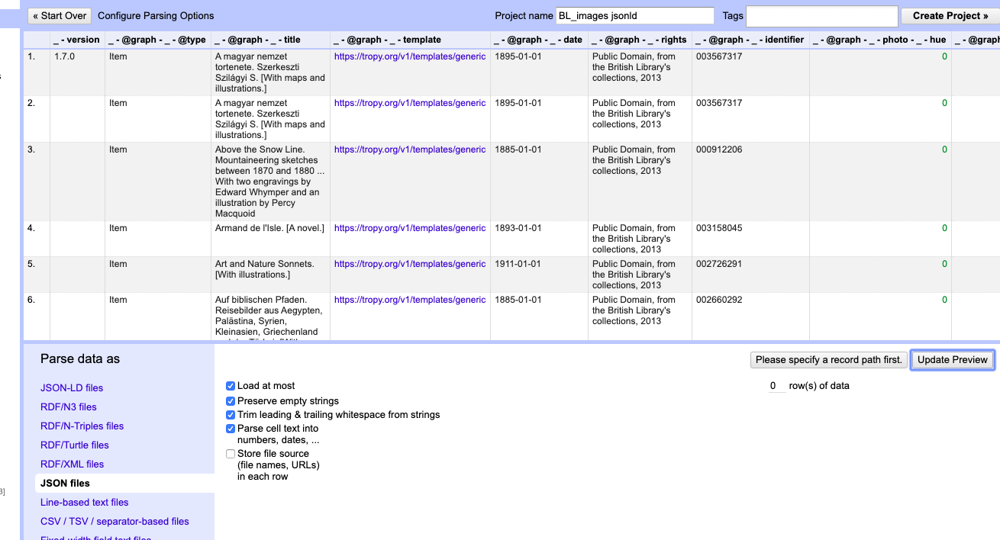
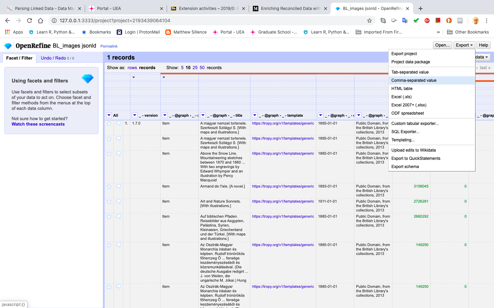

# Parsing Linked Data from Tropy

## Converting JSON-LD into CSV in Open Refine

One of the limitations of the CSV export plugin in Tropy is the selectivity of the data that can be exported. As noted above, Tropy employs different metadata sets depending on the selected template. For example, the document origin of an image and the photographic metadata of the digital image file itself.

The CSV export plugin allows you to select which of these metadata to export to a readable file, but how can we include all of the linked metadata?

If you have experimented with [Open Refine](open-refine.md#1-introduction), then you will be aware of the range of file types that the application can import, and those that it can export. As well as being a very effective tool for cleaning [messy data](./#understanding-messy-data), Open Refine is useful for managing the [data structure](./#structuring-data) between applications, effectively bypassing some of the limitations of built-in import/export functionality.

## Importing and Parsing JSON-LD

Start Open Refine in a new browser window, and follow the upload options by locating your JSON-LD file [exported from Tropy](tropy.md#3-5-exporting-metadata-json-ld).

In the 'Parse data as' area, select 'Load at most', 'Preserve empty strings', 'Trim leading & trailing whitespace from strings' and 'Parse cell text into numbers, dates, ...'. You may need to update the preview to see how the data will be structured.

The metadata should be structured in a table format and displayed as rows or records, and will be more substantial than the CSV metadata covered in the [previous section](tropy.md#3-6-exporting-metadata-csv).

Explore the data further and note any data cleaning requirements in each column. If you would like to make any changes, consult the Open Refine workbook for examples of [transforming multi-value cells](open-refine.md#8-transforming-multi-value-cells-with-grel) or[ standardizing dates](open-refine.md#9-standardizing-dates).

When you are satisfied with the quality of the metadata, export the data set as a CSV file, using the 'comma separated value' option and save locally on your device.

Now that the data are saved locally, import the CSV file into your preferred spreadsheet application. In the following example, we will use Microsoft Excel.

