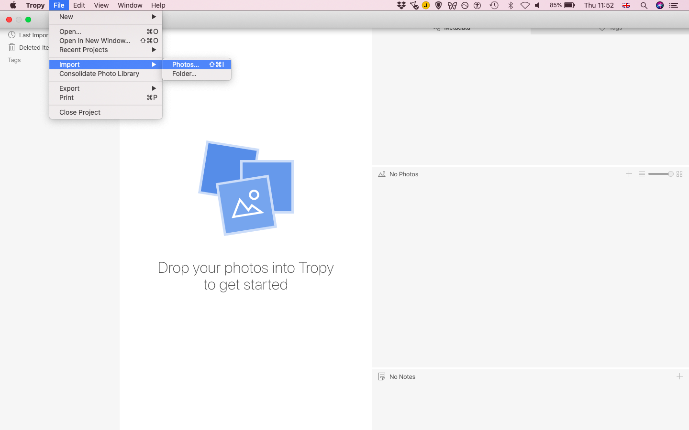
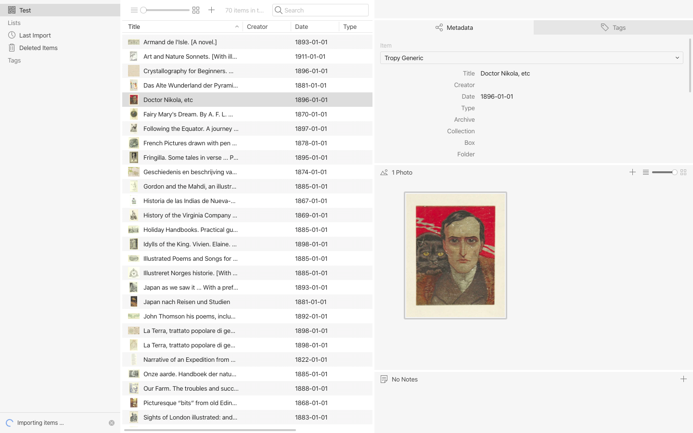
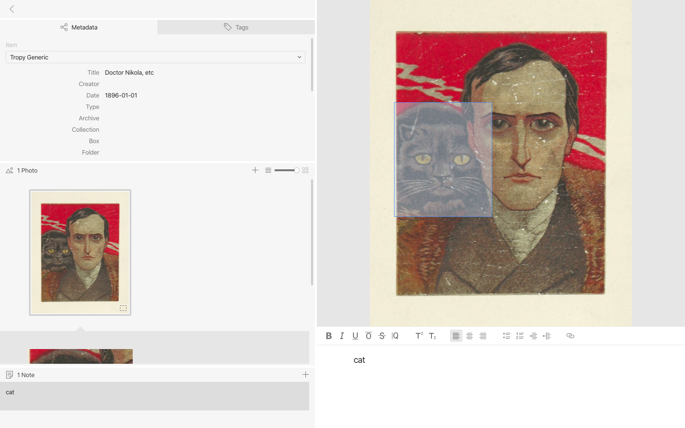
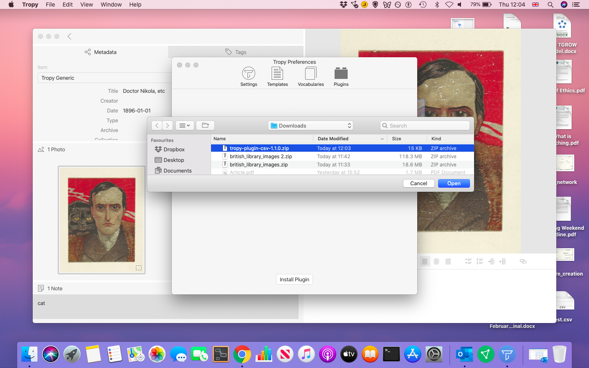
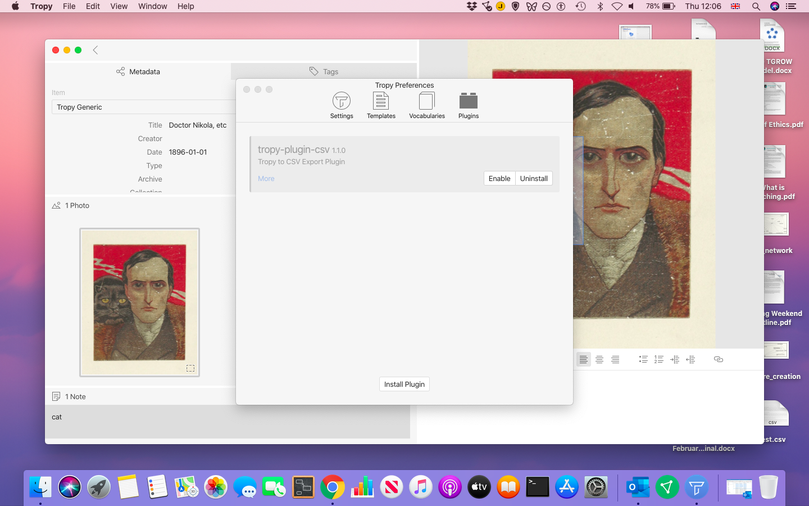
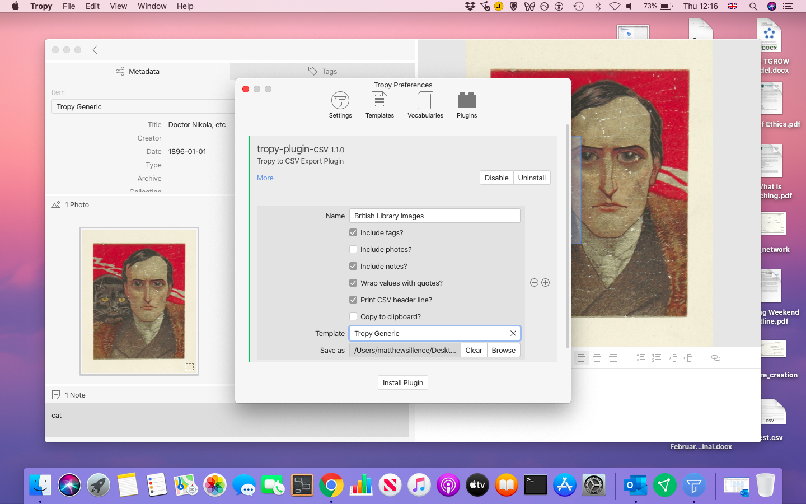
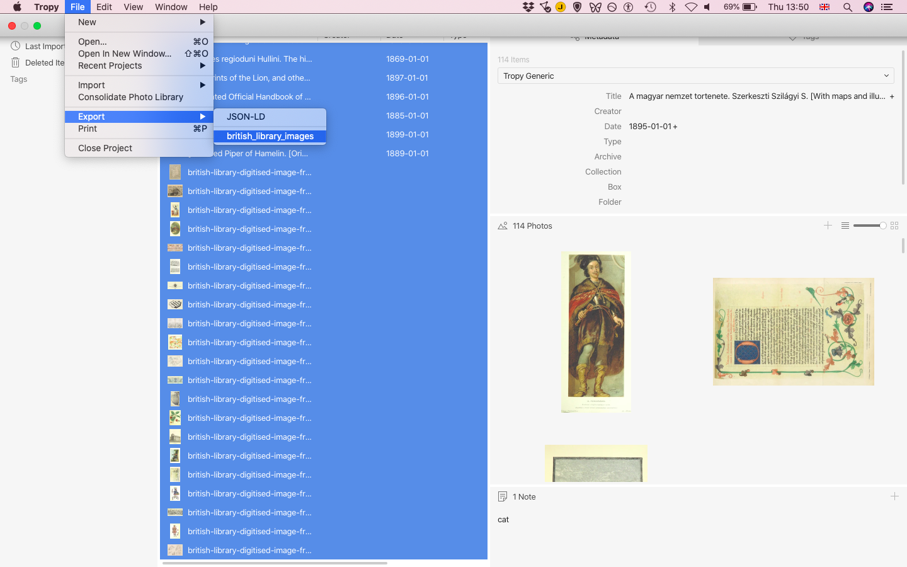

# Tropy

## **Getting Started with Tropy**

Tropy \([https://tropy.org/](https://tropy.org/)\) is free software. It is available for Mac OS and Windows.

### **For Windows**

1\) Navigate to the Tropy homepage and click on the download button.  
2\) Click ‘Save File’ to save the programme to a local folder on your device. The download may take several minutes.  
3\) Select the Tropy application file from the download directory and begin the installation.  
4\) If the installation is successful, you will see a new window appear with the welcome message and prompt to ‘Create Project’.

### **For Mac OS**

1\) Navigate to the Tropy homepage and click on the download button.  
2\) Click on the ‘save file’ option to store the .dmg file locally. The download may take a few minutes to complete.  
3\) Once the file has downloaded, drag the Tropy icon into the Applications folder to start the installation.  
4\) When Tropy has installed, it will be visible in the Launchpad section of the desktop. Just click on the icon to start the application.

* Annotation and Transcription
* Metadata standards
* Exporting as JSON linked data

## 
 **An Introduction to Tropy**

Tropy is a free application that allows the user to manipulate, manually add and export metadata for images. The advantages for researchers working with images files are to synthesise different research materials using standard vocabularies, as well as flexibility in the use of notes, transcriptions and user-generated tags.

### The Dataset

To get started, create a new project called 'One Million Images'. Now open a browser on your device and navigate to: [https://www.flickr.com/photos/britishlibrary/albums/72157638544764936](https://www.flickr.com/photos/britishlibrary/albums/72157638544764936)

Download the set of images to a folder on your device. This may take a few minutes to complete. Unzip the contents.

These images were released by the British Library as part of its 'One Million Images' [initiative](https://britishlibrary.typepad.co.uk/digital-scholarship/2013/12/a-million-first-steps.html#sthash.3kaubTLH.dpuf). These images were the remains of a large-scale book [digitisation](https://www.bl.uk/digitisation-services/bulk-digitisation) project by Microsoft, and they comprise illustrations, maps, diagrams, frontispieces and other graphic materials that appeared alongside the original printed text.  

This dataset comes from a project by the British Library Labs team to digitally curate these images, in the first instance using facial recognition: [https://blogs.bl.uk/digital-scholarship/2013/09/the-mechanical-curator.html](https://blogs.bl.uk/digital-scholarship/2013/09/the-mechanical-curator.html)

The 'Mechanical Curator' posted these images to [Tumblr](https://mechanicalcurator.tumblr.com/). This dataset is a small collection of highlights that were uploaded by the British Library to [Flickr](https://www.flickr.com/people/britishlibrary/).

### Importing Images

Tropy allows the user to begin by importing digital image files, which could be those taken by the researcher, such as photographs of documents, and  In this case we are going to use a set of images that were curated from a collection made publicly available by the British Library. These images come from pages scans from the British Library's collections, which are out of copyright.

Inside Tropy,  select ‘File’ then ‘Import Photos’. Find the ‘British Library Images’ folder on your device, select all files and then choose ‘Open’. It will take a few moments to import all of the image files.



### Image Metadata and Controlled Vocabularies

When the import is complete, you will see either a list of image files, or thumbnails \(small versions of each image\).



One the right hand side of the screen is a panel containing several tabs and panes. These are: ‘Metadata’, ‘Tags’, ‘Photo’ and ‘Notes’. By clicking on one image, you will see some details appear in the ‘Metadata’ tab, namely its ‘Title’, which here is the filename of the image file.

You will also see a drop-down box called ‘Items’. This refers to the particular metadata template that Tropy is using for the images. In this case it is a default template called ‘Tropy Generic’. It includes fields such as ‘Creator’, ‘Type’ ‘Archive’ and ‘Collection’. These are used to catalogue each image file. 

As Tropy has been designed for researchers, the creators of the software have placed an archival emphasis on the Metadata, which means that there are a number of fields that refer to the origin of the material \(e.g. where it came from\).

As Tropy is designed to help researchers search their image collections, it is helpful if the terms that have been used to describe the image are **controlled** as much as possible. This means that Tropy is built to be used with certain **vocabularies**.

The three templates that are packaged with Tropy are:

* Tropy Generic
* Tropy Correspondence
* Dublin Core

Each has slightly different fields and uses controlled vocabularies. If you want to know more about the vocabularies, select ‘Edit’ from the menu bar, then ‘Preferences’ to examine the software’s settings. When the preferences window opens, select the ‘Vocabularies’ icon.

Clicking on the relevant vocabulary will provide a list of how each field is defined, and what it is to be used for. Take a few moments to examine these.

One useful vocabulary and template is Dublin Core element set: [http://dublincore.org/documents/dces/](http://dublincore.org/documents/dces/)

This a set of 15 ‘properties’ to describe resources. These are thought to be sufficiently broad and generic to cover most resources, and be readable by other applications. We will cover more about this is the second part of today’s workshop.

For our first task, we will add some basic metadata into all of the images. If we know this applies to all of the images in the set, then it can be done as a batch, rather than one at a time \(which would take us all day!\).

Select the first image in the set, then scroll down to the last and hold down Ctrl/Cmd and click on the last image. This should select the whole set of images.

With these selected, click on the ‘Metadata’ tab and select the ‘Archive’ field. Now, type in ‘British Library’.

Next, click on the ‘Type’ field and enter ‘Image’ using the same procedure, to ensure that all of the photos have the correct item type. 

If you like, you can continue to add in further metadata. If, for example, you wanted to reference the publisher, you could use a Dublin Core template, which has a field for a ‘Publisher’, and you could include the publication details from the book's bibliographic metadata from the British Library catalogue.

When you add metadata to all of the selected images, and if those images are all using the same template, then when you switch to a list view of the files, you will see that they all have the same metadata.

### Image Tags

As well as the metadata, Tropy allows the user to create certain tags. There is considerably more freedom in creating tags – the user is not limited to just describing the digital object in terms of its type, creator/author, or publisher. Tags can refer to content elements of the digital image, in the same way that users have contributed tags to the British Library’s One Million Images on Flickr: [https://www.flickr.com/photos/britishlibrary/](https://www.flickr.com/photos/britishlibrary/).

So, let’s begin by looking more closely at those images. By dragging the zoom slider at the top of the screen, you can control the size of thumbnails.

#### Annotation of Selections

Tagging is a useful way of navigating large numbers of images to allow further manual analysis, or closer reading of each image \(and in this case that is image and text\).

One of the useful functions of Tropy is selection, which allows regions of the image to be annotated. It might form a use region of interest for manual annotation, or where text is present, transcription.

Open one of the image files, and use the zoom function to find the panels you are interested in.

Now, using the ‘Selection Tool’ on the menu bar at the top of the screen, you will see crosshairs appear. Click on the top left corner of the panel you require and drag the box to the bottom right corner to select the relevant panel.



The panel is now selected. You will also see another image file appear on the left hand ‘Photo’ pane. Clicking on the new photo called ‘Selection’ you can now add in specific information using the ‘Notes’ pane at the bottom of the screen. In this case, we can add in some of the dialogue.

Like metadata and tags, notes can become part of the search function of Tropy. In the Windows version, there have been some reported problems with the search \(as this is quite a new piece of software\), but the tag filter seems to be working well.

## Exporting Metadata: JSON-LD

As we noted above, standard vocabularies are helpful in making metadata more accessible. The use of certain schema can help to structure the data so that it can be handled more effectively in future.

When exporting metadata, Tropy uses something JSON-LD \(JavaScript Object Notation for Linked Data\). Linked data is a way of expressing the relationships between data that can be read by both humans and machines. It is designed to be used with the web, as a way of linking otherwise ‘messy’ data.

At its most basic, JSON-LD files contain some essential elements:

**Property** – this is effectively the ‘label’ that defines the ‘edge’ of a node \(where one object connects to another\)

**Value** – this is the string that is labelled by the property \(e.g. “2000-12-13” is the value of a “date” property\)

To export items, select all of those required and right-click \(Ctrl + click on a Mac\) on one of the selected items to bring up the options, and selected ‘Export Selected Items’.

Find a location on your device and save the file with a recognisable name. The file itself is not always recognised by devices. If you are using Windows, you might want to use an application like WordPad or Brackets \([http://brackets.io/](http://brackets.io/)\) to open and read the file. On a Mac, you can use the TextEdit application.

When you open a JSON-LD file, you will see how the properties and values are expressed. If you want to see how linked data operates, there is a helpful online tool called the JSON Playground: [https://json-ld.org/playground/](https://json-ld.org/playground/) This can help a user to visualise the nodal model of linked data.

Copy the following JSON-LD example into the JSON-LD input window.

```text
{
  "@context": {
    "dc11": "http://purl.org/dc/elements/1.1/",
    "ex": "http://example.org/vocab#",
    "xsd": "http://www.w3.org/2001/XMLSchema#",
    "ex:contains": {
      "@type": "@id"
    }
  },
  "@graph": [
    {
      "@id": "http://example.org/library",
      "@type": "ex:Library",
      "ex:contains": "http://example.org/library/the-republic"
    },
    {
      "@id": "http://example.org/library/the-republic",
      "@type": "ex:Book",
      "dc11:creator": "Plato",
      "dc11:title": "The Republic",
      "ex:contains": "http://example.org/library/the-republic#introduction"
    },
    {
      "@id": "http://example.org/library/the-republic#introduction",
      "@type": "ex:Chapter",
      "dc11:description": "An introductory chapter on The Republic.",
      "dc11:title": "The Introduction"
    }
  ]
}
```

To visualise this item, just click on the ‘Visualized’ button. In the pane below, you will see what is called a ‘graph’ – a representation of the item as a node.

Each ‘edge’ of the node has the potential to connect with other items. For example, the “creator” property and its value could relate to a Wikipedia entry on that individual.

Exporting metadata created by the researcher in standard formats, using models like linked data, makes images, particularly in large collections, much easier to relate to others, thereby enriching our experience and understanding of the digital image.

## Exporting Metadata: CSV

An alternative method of exporting data from Tropy is provided through GitHub as a plugin. Tropy provides a guide to installation here: [https://docs.tropy.org/other-features/export-with-plugins](https://docs.tropy.org/other-features/export-with-plugins) The package of data can be found on GitHub: [https://github.com/inukshuk/tropy-plugin-csv/releases/tag/v1.1.0](https://github.com/inukshuk/tropy-plugin-csv/releases/tag/v1.1.0) 



Follow the installation prompts on screen, and click 'Enable'.



It is important, before attempting the export, to ensure that the template has been set for the import. At the prompt, provide a name for the plugin. We will use 'British Library Images' in this example. Next, select the 'Tropy Generic' template \(or your preference for your own collection, depending on how you would like the metadata to be structured\).


The final step is to set the file name and location, using the 'Save as' option. Click 'Browse' identify a folder on your device to save the data in, and provide the file name 'british\_library\_images.csv'. When these settings have been added, just close the window \(there is no need to save\).



Return to the list of images in Tropy and select all of the images in the list. From the menu bar select 'File' &gt; 'Export' &gt; 'british\_library\_images'. Locate the file on your desktop and open the CSV file by importing it into your preferred spreadsheet application.




